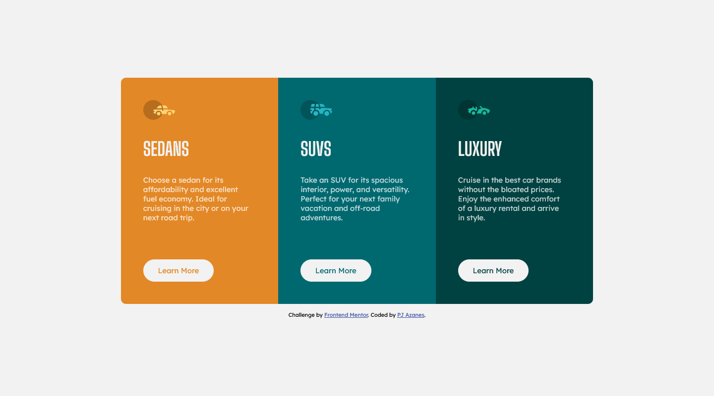

# Frontend Mentor - 3-column preview card component solution

This is a solution to the [3-column preview card component challenge on Frontend Mentor](https://www.frontendmentor.io/challenges/3column-preview-card-component-pH92eAR2-). Frontend Mentor challenges help you improve your coding skills by building realistic projects. 

## Table of contents

- [Overview](#overview)
  - [The challenge](#the-challenge)
  - [Screenshot](#screenshot)
  - [Links](#links)
- [My process](#my-process)
  - [Built with](#built-with)
  - [What I learned](#what-i-learned)
- [Author](#author)

## Overview

### The challenge

Users should be able to:

- View the optimal layout depending on their device's screen size
- See hover states for interactive elements

### Screenshot



### Links

- Solution URL: [Add solution URL here](https://your-solution-url.com)
- Live Site URL: [Github Page](https://pjazanes.github.io/3-column-preview-card-component-main/)

## My process

### Built with

- Semantic HTML5 markup
- CSS custom properties
- Flexbox
- Mobile-first workflow

### What I learned

- Custom properties aren't usable on media queries.
```css
/* I've tried this but it turns out that it's not possible. */
@media screen and (min-width: calc(var(--desktop) / 2)){
}
```

- Right use of pseudo-elements.
```css
.card.sedans .card-details::before {
    content: url(images/icon-sedans.svg);
}
```

- Usage of @import rule in css file instead of link tag in html file
```css
@import url('https://fonts.googleapis.com/css2?family=Big+Shoulders+Display:wght@700&display=swap');
``` 

- Importance of comments. I saved some time by not looking back and fort anymore between the style guide and my css file. 

## Author

- Website - [Github](https://github.com/pjazanes)
- Frontend Mentor - [@pjazanes](https://www.frontendmentor.io/profile/pjazanes)
